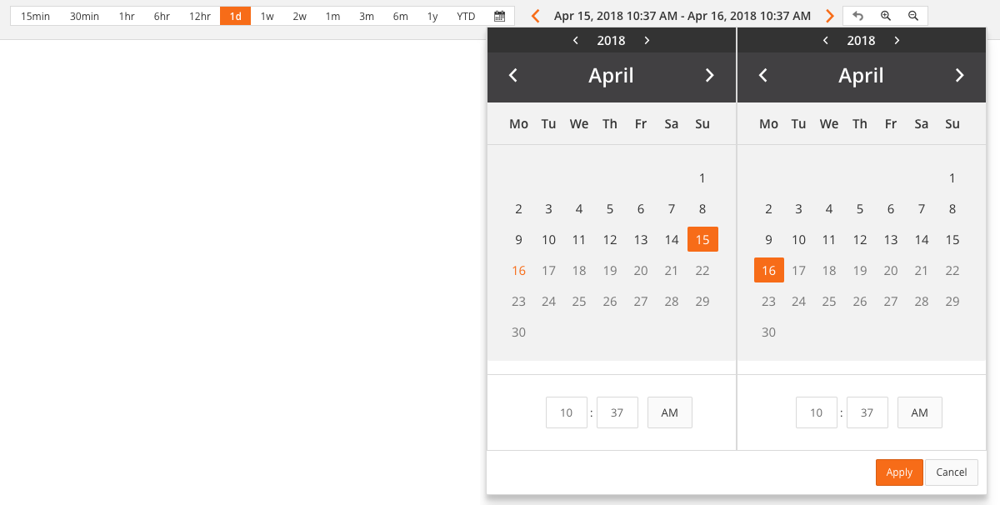

# Sample Time Filter Component using Angular 4.0.0 - David Shaevel

### 10/25/2017

---

## Description
A coding sample of some Angular 4 components, models, services, and tests:

* Components:

  `src/app/components/`

* Models:

  `src/app/model/`

* Services:

  `src/app/services/`

## Screenshots:

Expanded Layout

Responsive (collapsed) Layout
